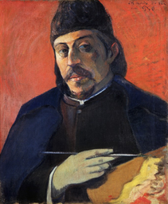
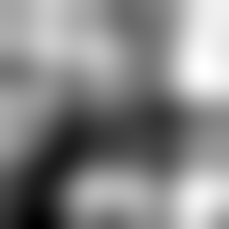
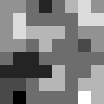

#  Reddit Deduplicator

A web extension to hide duplicate posts on pre-redesign Reddit.

When viewing a list of posts on reddit.com, the extension finds posts with the
same URL or thumbnail and groups them together, showing only the first
instance.

This is particularly useful when viewing an individual user's posts, as some
users will post the same link or upload the same image to multiple subreddits.
It can also be useful for viewing subscriptions or multireddits that aggregate
posts from similar subreddits.

## Screenshots

|  |
| :---: |
| *The extension automatically detects and hides duplicate posts.* |

|  |
| :---: |
| *Click the "show"/"hide" link to reveal or hide duplicates.* |

## Technical discussion

### Perceptual image hashing

To detect duplicate thumbnails, the extension uses a perceptual hash algorithm
to reduce each image to a 64-bit hash. Ideally, a perceptual hash algorithm
should be insensitive to minor changes in an image — visually similar images
should have similar hash values. This extension offers two alternative hash
functions:

* **DCT Hash**: Scale the image to 32x32 and compute the direct cosine transform
  (DCT) of the pixel luminance values. Use the sign bits of the upper-left
  triangle of coefficients as the bits of the hash.

  This hash has good accuracy as much of the perceptual information in an image
  is contained in the low-frequency components of the DCT. We can even use the
  hash to reconstruct an image that preserves many large-scale features of the
  original (see below).

  However, the DCT can be slow to compute, as a naive implementation requires
  O(n3) multiplications for an n×n input matrix. We use an optimized
  fast-DCT algorithm to compute the DCT with fewer arithmetic operations.

    |  |  |
    | :---: | :---: |
    | *Original* | *DCT hash   visualization* |

* **Difference Hash**: Scale the image to 8x8 grayscale and compare adjacent
  pixels along a space-filling loop. Use the results of the comparison as the
  bits of the hash.

  This hash is very fast to compute, but is sensitive to minor fluctuations in
  brightness across "flat" areas of the image where the difference in
  brightness is close to zero.

* **Wavelet Hash**: Scale the image to 32x32 and compute the discrete wavelet
  transform (DWT). We use the Haar wavelet given the small input size, and for
  simplicity. Take the sign bits of the upper 8x8 coefficients of the
  transformed matrix as the bits of the hash.

  Using the fast wavelet transform algorithm, this hash is relatively fast to
  compute and improves on the difference hash by balancing local and global
  pixel comparisons. As with the DCT hash, it is possible to reconstruct
  something resembling the original image from the hash bits, although at a
  very low resolution.

    |  |  |
    | :---: | :---: |
    | *Original* | *Wavelet hash   visualization* |

For an interactive visualization of the different hash functions, see the
[perceptual hash demo](phdemo/).

### Finding similar hashes

Although searching for exact matches works surprisingly well, in order to
further reduce false negatives we group thumbnails whose hash values differ by
only a few bits. To find such almost-equal hashes, we use a BK-tree, a simple
data structure adapted to discrete metric spaces such as Hamming space.

## Known limitations

* **Crop sensitivity** For both image hash algorithms currently supported,
  cropping an image can radically change its hash value, which can cause the
  extension not to detect near-duplicates with slight framing differences.

* **Unrelated duplicate thumbnails** Sometimes unrelated pages for non-media
  sites will have the same thumbnail. For example, news articles from *The
  Independent* are sometimes wrongly identified as duplicates due to having the
  same generic "breaking news" thumbnail.

* **Variant URLs** Sometimes different users will post the same URL with small
  variations, such as tracking parameters. Currently the extension only looks
  for exact duplicates when deduplicating by URL.

## Credits

Merge icon by [Freepik](https://www.freepik.com/) from [www.flaticon.com](https://www.flaticon.com/) (modified from original).
